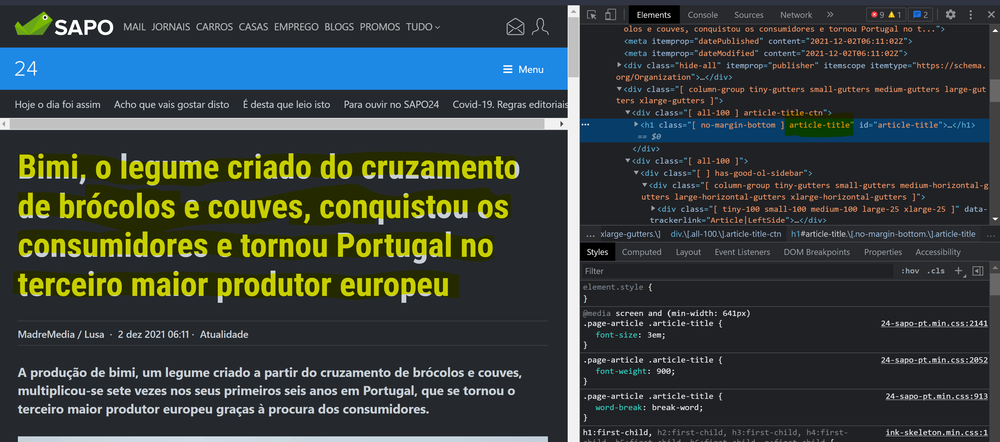

# scraping101_py
An example of how to scrape a newspapers' website using Python, requests and bs4.

## Description

This small project is meant to exemplify how one can easily scrape a newspaper website - this is a free access website, you'd use selenium should log in actions be required - to retrieve articles and respective content, writing the results to a csv file with one article per line.

The approach is ammenable to feed downstream Natural Language Processing applications, especially if combined with the Mediacloud API endpoint for identifying article urls of interest.

## Installation and set up

Git and Python (you can change the version in Pipfile) is assumed. To set up run:

```
git clone git@github.com:marquesafonso/scraping101_py.git
pip install pipenv
pipenv install
```
## Usage

Here we grab 5 articles from https://24.sapo.pt/, place them in a list and inspect the html using the F12 key in the browser. See the image below for an example:

</img>

This allows us to investigate the elements we wish to scrape:

<ul>
    <li><strong>Label:</strong> The category of the article.</li>
    <li><strong>Title:</strong> The title of the article.</li>
    <li><strong>Lead:</strong> The lead of the article.</li>
    <li><strong>Author:</strong> The author of the article.</li>
    <li><strong>Date:</strong> The date the article was published in.</li>
    <li><strong>Body:</strong> The article text itself.</li>
</ul>

The requirements of the project are:

<ul>
    <li><strong>requests:</strong> Allows us to make HTTP requests to the urls we wish to scrape, returning the html as the response</li>
    <li><strong>bs4:</strong> Allows us to convert the responses from the requests into soup objects, which come with methods such as find() allowing us to efficiently parse the html and retrieve the text we are looking for. </li>
</ul>

Two additional functions are used to conveniently convert the date strings into a general date/time pattern (long time) - see https://docs.microsoft.com/en-us/dotnet/standard/base-types/standard-date-and-time-format-strings for more info. This makes the date string ready for more interesting uses and to be loaded to a database if needed.

Feel free to play around with the code and adapt it to your needs. To test it simply run:

```
pipenv run python scraper.py --outfile 'output/ex_scrape.csv'
```

And check out the output folder to see the results!
